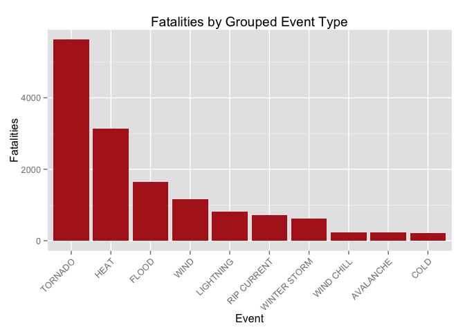
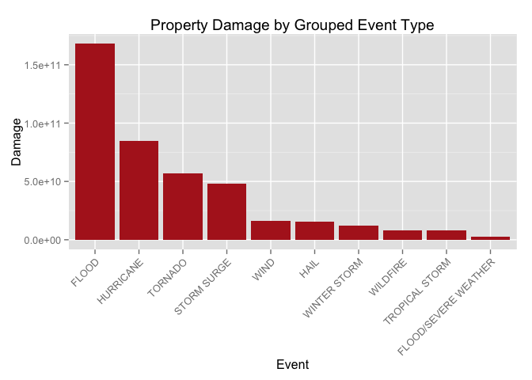

# Severe Weather Event Analysis
December 26, 2015  


## Synopsis
The data contains information about Storm Data as reported to NOAA by the National Weather Service from 1950 to 2015. It is a record of meterological events with "sufficient intensity to cause loss of life, injuries, significant property damange, and/or disruption to commerce."

Across the country:  
- tornados, heat, and floods are responsible for the most deaths.  
- tornados, wind, and heat cause the most injuries.  
- floods, hurricanes, and tornados cause the most property damage.  

## Data Processing

### Data Loading


```r
fileURL <- "https://d396qusza40orc.cloudfront.net/repdata%2Fdata%2FStormData.csv.bz2"
download.file(fileURL, destfile = "dataset.zip", method = "curl")
data <- read.csv("repdata-data-StormData.csv.bz2")
```

There are 902297 observations and 37 variables. However, we will subset the data to only look at the variables of interest:

- **EVTYPE**: description of event type
- **FATALITIES**: number of people killed in storm
- **INJURIES**: number of people injured in storm
- **PROPDMG**: property damage in dollars
- **PROPDMGEXP**: denotes multiple of property damage


```r
variables <- c("EVTYPE", "FATALITIES", "INJURIES", "PROPDMG", "PROPDMGEXP")
dataSub <- data[, variables]
```

### Data Preparation

We need to convert the property damage dollar values to use the correct units. We will create a new variable to house these calculated figures.


```r
# Convert units to calculate property damage
dataSub$PROPDMGTOT = 0
dataSub[dataSub$PROPDMGEXP == "H", ]$PROPDMGTOT = dataSub[dataSub$PROPDMGEXP == "H", ]$PROPDMG * 10^2
dataSub[dataSub$PROPDMGEXP == "K", ]$PROPDMGTOT = dataSub[dataSub$PROPDMGEXP == "K", ]$PROPDMG * 10^3
dataSub[dataSub$PROPDMGEXP == "M", ]$PROPDMGTOT = dataSub[dataSub$PROPDMGEXP == "M", ]$PROPDMG * 10^6
dataSub[dataSub$PROPDMGEXP == "B", ]$PROPDMGTOT = dataSub[dataSub$PROPDMGEXP == "B", ]$PROPDMG * 10^9
```

The EVTYPE variable needs to be cleaned up and normalized to correct for inconsistent capitalization and spacing that may impact results. 


```r
# make all results uppercase
dataSub$EVTYPE <- toupper(dataSub$EVTYPE)

# remove leading and trailing white space from events
dataSub$EVTYPE <- gsub("^\\s+ | \\s+$", "", dataSub$EVTYPE)

# reset to factor variable
dataSub$EVTYPE <- as.factor(dataSub$EVTYPE)
```

Finally, we need to clean up the EVTYPE variable to group events with similar names. We will focus primarily on grouping results that are top causes for loss of life or property.

This reduces the noise in our results and lets us focus on true themes in the data.


```r
# replace abbreviations
dataSub$EVTYPE <- gsub("TSTM","THUNDERSTORM", dataSub$EVTYPE)
dataSub$EVTYPE <- gsub("FLD","FLOOD", dataSub$EVTYPE)

# adjust for plurals, etc
dataSub$EVTYPE <- gsub("WINDS","WIND", dataSub$EVTYPE)
dataSub$EVTYPE <- gsub("CURRENTS","CURRENT", dataSub$EVTYPE)
dataSub$EVTYPE <- gsub("FLOODING","FLOOD", dataSub$EVTYPE)

# create a new variable to group similar events
dataSub$GROUPEDEVENTS <- dataSub$EVTYPE

# create a new variable to group similar events
dataSub$GROUPEDEVENTS <- gsub(".*HEAT|HEAT WAVE*.","HEAT", dataSub$GROUPEDEVENTS)
dataSub$GROUPEDEVENTS <- gsub(".*FLOOD*.|.*FLASH FLOOD*.|HEAVY RAIN", "FLOOD", dataSub$GROUPEDEVENTS)
dataSub$GROUPEDEVENTS <- gsub("FLOOD/FLOOD", "FLOOD", dataSub$GROUPEDEVENTS)
dataSub$GROUPEDEVENTS <- gsub(".*COLD|COLD WEATHER","COLD", dataSub$GROUPEDEVENTS)
dataSub$GROUPEDEVENTS <- gsub(".*WIND","WIND", dataSub$GROUPEDEVENTS)
dataSub$GROUPEDEVENTS <- gsub("BLIZZARD|HEAVY SNOW|ICE STORM|WINTER WEATHER*.|COLDND SNOW|ICE|SNOW|ICY ROADS|WINTER STORMS","WINTER STORM", dataSub$GROUPEDEVENTS)
dataSub$GROUPEDEVENTS <- gsub("WINTER STORMMIX|COLD AND WINTER STORM|WINTER STORMS","WINTER STORM", dataSub$GROUPEDEVENTS)
dataSub$GROUPEDEVENTS <- gsub(".*HIGH SURF","RIP CURRENT", dataSub$GROUPEDEVENTS)
dataSub$GROUPEDEVENTS <- gsub("HURRICANE/TYPHOON|HURRICANE ERIN|HURRICANE OPAL","HURRICANE", dataSub$GROUPEDEVENTS)
dataSub$GROUPEDEVENTS <- gsub("TROPICAL STORM GORDON","TROPICAL STORM", dataSub$GROUPEDEVENTS)
dataSub$GROUPEDEVENTS <- gsub("WINDCHILL","WIND CHILL", dataSub$GROUPEDEVENTS)
dataSub$GROUPEDEVENTS <- gsub("WILD/FOREST FIRE","WILDFIRE", dataSub$GROUPEDEVENTS)
dataSub$GROUPEDEVENTS <- gsub("STORM SURGE/TIDE","STORM SURGE", dataSub$GROUPEDEVENTS)
```

## Results

### Fatalaties
The analysis section explores the type of storms most like to cause loss of life.


```r
# aggregate fatalities by event type
dataFatalities <- aggregate(dataSub$FATALITIES, by = list(dataSub$GROUPEDEVENTS), FUN = sum, na.rm = TRUE)
names(dataFatalities) <- c("Event", "Fatalities")

# find top 10 events that cause fatalities
dataFatalities <- dataFatalities[order(dataFatalities$Fatalities, decreasing = TRUE), ]
fatalitiesTop10 <- dataFatalities[1:10, ]

# create a factor to assist in plotting
fatalitiesTop10$Event <- factor(fatalitiesTop10$Event, levels = fatalitiesTop10$Event)
```


```r
# plot
library(ggplot2)

ggplot(data = fatalitiesTop10, aes(x = Event, y = Fatalities)) + geom_bar(stat = "identity", fill = "firebrick") + theme(axis.text.x = element_text(angle = 45, hjust = 1)) + ggtitle("Fatalities by Grouped Event Type")
```

 

### Injuries
The analysis section explores the type of storms most like to cause injury and bodily harm.


```r
# aggregate injuries by event type
dataInjuries <- aggregate(dataSub$INJURIES, by = list(dataSub$GROUPEDEVENTS), FUN = sum, na.rm = TRUE)
names(dataInjuries) <- c("Event", "Injuries")

# find top 10 events that cause injuries
dataInjuries <- dataInjuries[order(dataInjuries$Injuries, decreasing = TRUE), ]
injuriesTop10 <- dataInjuries[1:10, ]

# create a factor to assist in plotting
injuriesTop10$Event <- factor(injuriesTop10$Event, levels = injuriesTop10$Event)
```


```r
ggplot(data = injuriesTop10, aes(x = Event, y = Injuries)) + geom_bar(stat = "identity", fill = "firebrick") + theme(axis.text.x = element_text(angle = 45, hjust = 1)) + ggtitle("Injuries by Grouped Event Type")
```

 

### Property and Crop Damage
The analysis section explores the type of storms most like to cause damage to property.


```r
# aggregate property damage by event type
dataProp <- aggregate(dataSub$PROPDMGTOT, by = list(dataSub$GROUPEDEVENTS), FUN = sum, na.rm = TRUE)
names(dataProp) <- c("Event", "Property_Damage")

# find top 10 events that cause property damage
dataProp <- dataProp[order(dataProp$Property_Damage, decreasing = TRUE), ]
propertyTop10 <- dataProp[1:10, ]

# create factor to assist in plotting
propertyTop10$Event <- factor(propertyTop10$Event, levels = propertyTop10$Event)
```


```r
ggplot(data = propertyTop10, aes(x = Event, y = Property_Damage)) + geom_bar(stat = "identity", fill = "firebrick") + theme(axis.text.x = element_text(angle = 45, hjust = 1)) + labs(y = "Damage") + ggtitle("Property Damage by Grouped Event Type")
```

 
